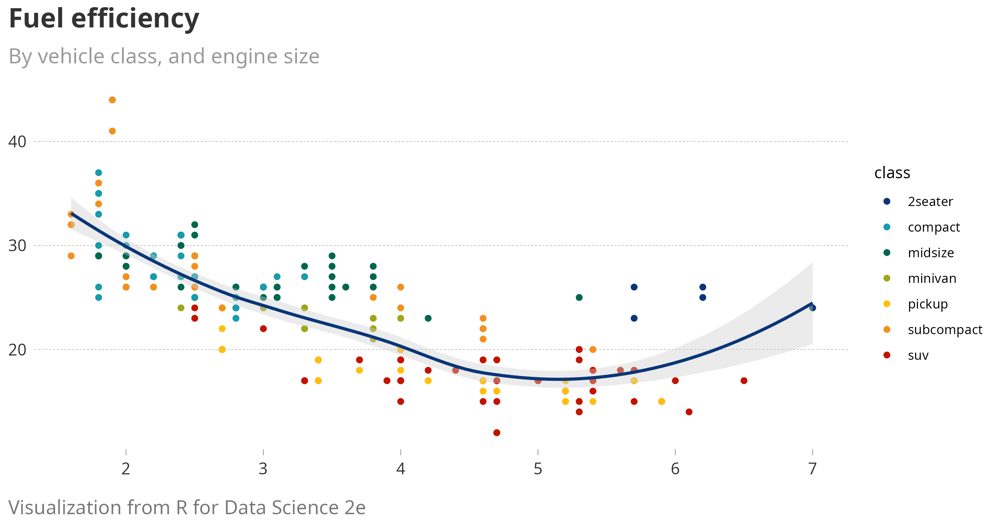
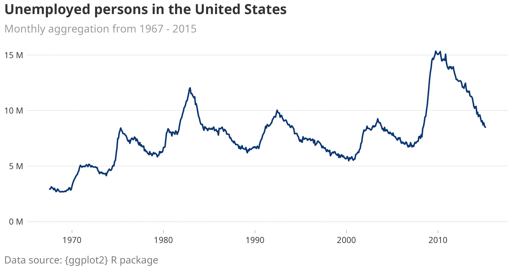

# Ggplot2 theme for WA DOSH

Ggplot2 theme to match WA DOSH graphic identity

## Useage

1. Save the theme script in `code/00-ggplot-theme-dosh.R`
2. Source the function with `source("./code/00-ggplot-theme-dosh.R")`
3. Call the theme in your ggplot with `theme_dosh()`

## Example:

```R
library(ggplot2)
mpg |> 
  ggplot(aes(x = displ, y = hwy)) +
    geom_point(aes(color = class)) +
    geom_smooth(se = FALSE) +
    labs(
      title = "Fuel efficiency",
      subtitle = "By vehicle class, and engine size",
      caption = "Visualization from R for Data Science 2e",
      x = NULL,
      y = NULL
    ) +
    theme_dosh()
```



Example 2:


